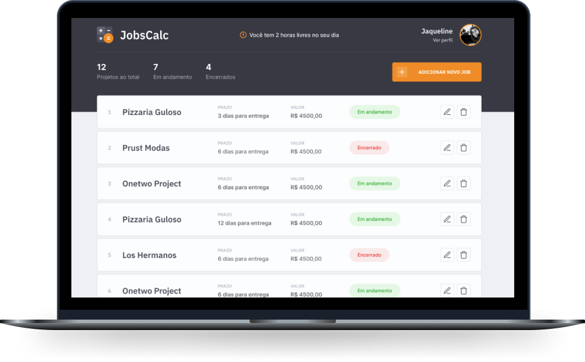

<h1 align="center">
  
</h1>

 

  

 

  

## 🚀 Technologies

This project was developed with the following technologies:

- HTML
- CSS
- JavaScript
- NodeJS
- EJS
- Express
- SQLite

## 💻 Project

JobsCalc is a calculation estimation application for freelance projects, where it is possible to register and exclude jobs (projects), obtaining a cost estimate for each job. In addition, it is possible to plot the hourly value of the person who will be using the system 💰

//TODO: Features

## 📝 License

This project is under the MIT license. See the [LICENSE](LICENSE.md) file for more details.

---

Made by [Felipe](https://github.com/felipepereirapinto)

Special thanks to [Rocketseat](https://discordapp.com/invite/gCRAFhc) for the [2nd Discover Marathon](https://github.com/rocketseat-education/maratona-discover-02).
